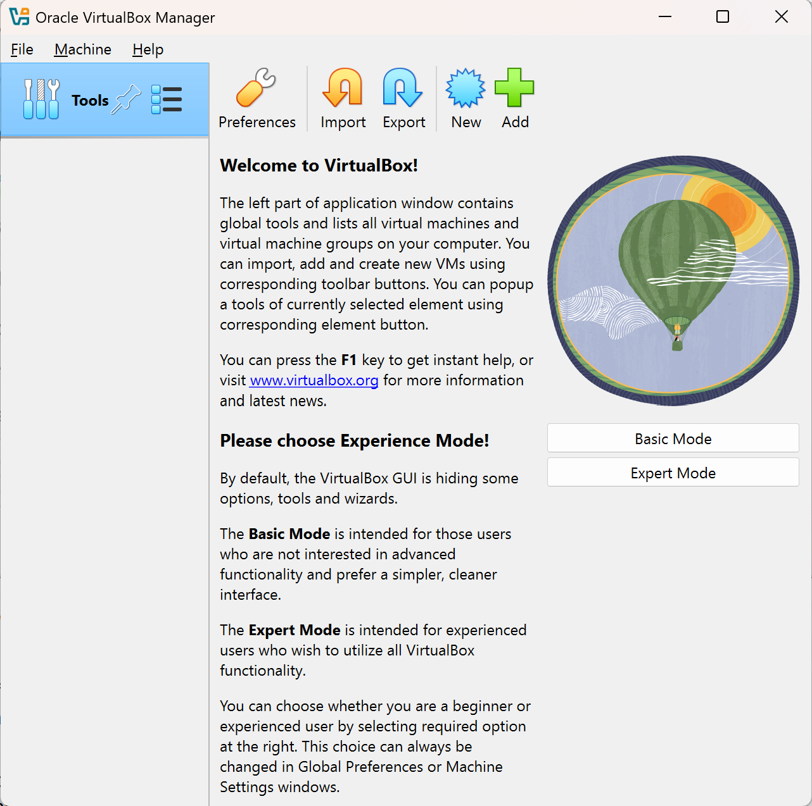

# h1 - Oma Linux

## x)
#### Tero Karvinen: Raportin kirjoittaminen
Tero Karvisen julkaisemassa raportin kirjoittamisohjeessa käydään läpi sitä, minkälaisia raportteja Linux-palvelimet -opintojakson harjoitustehtävistä tulisi laatia. Raportointi toimii hyvänä ohjeena myös kurssin ulkopuolella ja sitä voi hyödyntää kaikenlaisten tietokoneiden teknisten testien raportointiin. Raporttia olisi hyvä kirjoittaa koko ajan samalla kun tekee. Raporttien laatimisessa tulee huomioida muutamia tärkeitä asioita, joita ovat toistettavuus, täsmällisyys, helppolukuisuus ja lähteisiin viittaaminen. 

Toistettavuudella tarkoitetaan sitä, että toisen henkilön tulisi raportissa tehdyt toimenpiteet toistaessaan samassa ympäristössä saada sama tulos. Tähän tulokseen tulisi sisältyä kaikki myös kaikki sivupolut sekä harha-askeleet. Tämän vuoksi raportissa tulee myös raportoida tarkasti se ympäristössä, jossa testejä on suoritettu. Raporttien laatimiseen liittyen täsmällisyydellä tarkoitetaan sitä, että raporttiin kirjataan tarkasti ja yksityiskohtaisesti suoritetut toimenpiteet ja tehdyt havainnot. Raporttiin tulee kirjata esimerkiksi se, mistä on klikattu tai mikä komento on annettu, onnistuiko vai epäonnistuiko testi ja miten se todettiin sekä mitä suoritetun toimenpiteen jälkeen tapahtui. Raporttiin tulisi myös kirjata kellonajat, joiden perusteella ilmenee muun muassa se, miten kauan jonkin testin suorittamiseen on kulunut aikaa. Laadittujen raporttien tulisi myös olla helppolukuisia. Helppolukuisuutta voidaan lisätä esimerkiksi käyttämällä väliotiskoita ja kirjoittamalla huolellista kieltä kanavaan sopivasti. Lisäksi raporteissa tulee viitata lähteisiin. Lähteisiin viittaaminen osoittaa kirjoittajan perehtyneisyyttä aiheeseen, jonka lisäksi akateeminen käytäntö sekä hyvä tapa vaativat viittausten käyttöä. 

Raportteja kirjoittaessa ei saa väittää tehneensä jotain testiä, jota ei oikeasti ole tehnty eli ainoastaan tehdyistä toimenpiteistä ja testeistä saa raportoida. Tämän lisäksi raporteissa luvaton kuvien kopioiminen sekä plagiointi eli toisten tulosten omina esittäminen taikka kopiointi ilman lähteen esittämistä on rangaistavaa. 

#### Free Software Foundation: What is Free Software?
Free Software Foundationin tukeman GNU käyttöjärjestelmän verkkosivuilla julkaistussa artikkelissa kerrotaan vapaasta ohjelmistosta ja vapaan ohjelmiston käyttäjän neljästä olennaisesta vapaudesta. Artikkelissa kerrotaan, että vapaalla ohjelmistolla tarkoitetaan yhteisöä ja yksilön vapautta kunnioittavaa ohjelmistoa, jota käyttäjillä on mahdollisuus käyttää, kopioida, jakaa, tutkia, muuttaa ja kehittää. Ohjelmiston kerrotaan olevan vapaa ohjelma, jos sen käyttäjällä on seuraavat neljä vapautta: 

- Vapaus käyttää ohjelmaa mihin tahansa tarkoitukseen haluamallaan tavalla
- Vapaus tutkia, miten ohjelma toimii ja muuttaa sitä niin, että ohjelma toimii käyttäjän haluamalla tavalla
- Vapaus jakaa kopioita ohjelmasta auttaakseen muita
- Vapaus jakaa muille kopioita itse muokkaamistaan ohjelman versioista

Käyttäjän vapaudella käyttää ohjelmaa haluamallaan tavalla mihin tahansa tarkoitukseen tarkoitetaan sitä, että kenellä tahansa henkilöllä tai organisaatiolla on vapaus käyttää ohjelmaa millä tahansa tietokonejärjestelmällä mihin tahansa tarkoitukseen tai työhön ilman, että käyttäjän tarvitsee kommunioida asiasta ohjelman kehittäjän taikka muun tahon kanssa. Tämä tarkoittaa myös sitä, että jakaessaan vapaan ohjelmiston muille käyttäjille, käyttäjä ei voi velvoittaa muita käyttämään ohjelmaa johonkin tiettyyn haluamaansa tarkoitukseen. Jotta muutoksien tekeminen ohjelman lähdekoodiin sekä muokattujen versioiden jakaminen muille toteutuisivat, käyttäjällä on oltava pääsy ohjelman lähdekoodiin. Tämän vuoksi lähdekoodin saatavuus onkin ehto sille, että ohjelma on vapaa ohjelmisto. Vapaus jakaa kopioita tarkoittaa sitä, että kopiot voivat olla muutettuja tai muuttamattomia, niitä voi jakaa minne tahansa tai kenelle tahansa ja niitä voi jakaa joko maksullisina tai ilmaiseksi. 

## a)
Tässä harjoituksessa ansensin Linuxin ensimmäistä kertaa virtuaalikoneeseen Tero Karvisen laatiman yksityiskohtaisen ohjeen mukaisesti. Tein harjoituksen torstaina 2025-01-16 ja koneena oli Lenovon ThinkBook 13s G3 ACN -mallinen kannettava tietokone. 

Ensimmäiseksi latasin Debian ISO-tiedoston sivustolta https://cdimage.debian.org/debian-cd/current-live/amd64/iso-hybrid/. Valitsin Tero Karvisen laatimasssa asennusohjeessa olleiden neuvojen ja suositusten pohjalta sivuston vaihtoehdoista tiedoston nimeltä debian-live-12.9.0-amd64-xfce.iso. Tiedoston lataaminen kesti joitakin minuutteja. 

Aloitin harjoituksen tekemisen kello 18.20. Olin jo aikaisemmin ladannut tietokoneelle VirtualBoxin, joten pääsin heti aloittamaan itse virtuaalikoneen asentamisen. Aloitin asentamisen avaamalla VirtualBoxin ja valitsemalla valikosta kohdan New. Tästä aukesi uusi Create Virtual Machine -ikkuna. Tämän ikkunan ensimmäisessä välilehdessä mimesin virtuaalikoneen, valitsin lataamani ISO-tiedoston sekä laitoin täpän kohtaan Skip Unattended Installation. Seuraavalla välilehdellä asetin muistin kooksi 4000 MB ja pidin prosessoriydinten määrän yhdessä. Next-painikkeella siirryin seuraavalle välilehdelle, jossa pidin valittuna kohdan Create a Virtual Hard Disk Now ja asetin levyn kooksi ohjeen mukaan 60 GB. Viimeisellä välilehdellä oli yhteenveto tekemistäni valinnoista. Tarkistin, että tekemäni valinnat olivat oikein ja painoin sen jälkeen Finish-painiketta. Tämän jälkeen luomani virtuaalikone ilmestyi VirtualBoxin aloitusnäkymään.

 

KUVAT 1-5

Seuraavaksi kello 18.45 aloitin Debian ISO-tiedosto lisäämisen CD-ROMiksi ohjeen mukaan. Klikkasin ensin luomani virtuaalikoneen kohdalta hiiren vasemalla painikkeella ja valitsemalla avautuneesta valikosta kohdan Settings. Avautuneessa Settings-ikkunassa valitsin vasemmasta laidasta kohdan Storage ja huomasin, että tämä olikin jo tehty aikaisemmassa vaiheessa virtuaalikonetta luotaessa. Siirryin siis harjoituksen seuraavaan vaiheeseen.

KUVA 6

Aloitin boottauksen tekemisen kello 18.53 tuplaklikkaamalla luomani virtualikoneen kohdalta. Virtuaalikone työpöytä näkyin ensin todella pienenä, mutta sain sen suurennettua valitsemalla yläpalkista View -> Virtual Screen 1 -> Scale to 275%. Virtuaalikoneen käynnistyksen jälkeen auenneessa menussa ei näkynyt ohjeessa olevaa vaihtoehtoa, joten valitsin ylimmän vaihtoehdon Live system (amd64). Tästä aukesi virheilmoitus, jossa kerrottiin, että tämä ydin (kernel) tarvitsee x86-64 prosessoriytimen, mutta ainoastaan i686 prosessoriydin havaittiin, jonka vuoksi boottausta ei voitu tehdä.

KUVAT 7-9

Selvitin ongelmaa googlettamalla ja löysin vastauksen Stack Overflown verkkosivuilta. Kello 19.15 tarkastelin luomani virtuaalikoneen asetuksia ja huomasin, että version kohdalla oli Debian (32-bit) eikä ohjeen mukainen Debian (64-bit). Muutin version oikeaksi ja kokeilin sitten kello 19.17 boottausta uudelleen samalla tavalla kuin aikaisemmin. Tällä kertaa boottaus onnistui ja virtuaalikoneen työpöytä aukesi. Testasin verkkoselaimen toimivuutta klikkaamalla työpäydän vasemmassa ylänurkassa olevasta kohdasta Applications ja valitsin avautuneesta valikosta Web Browser. Kirjoitin hakukenttään "Haaga-Helia" ja pääsin sitä kautta siirtymään Haaga-Helian verkkosivuille eli verkkoselain toimi. Tämän jälkeen suljin verkkoselaimen. 

KUVAT 10-11

Kello 19.39 aloitin Debianin asentamisen. Virtuaalikoneen työpoydällä oli Install Debian -kuvake, jota kklikattuani hetken kuluttua aukesi Debian GNU/Linux Installer -ikkuna. Ensimmäisellä Welcome-välilehdellä valitsin kieleksi American English. Location-välilehdellä valitsin kartalta Suomen. Keyboard-välilehdellä valitsin Keyboard Model -kohdassa ohjeen mukaisesti vaihtoehdon Generic 105-key PC, vasemmanpuoleisesta valikosta Finnish ja oikeanpuoleisesta valikosta Default. Tämän jälkeen testasin vielä, että näppäimistö toimii ja pystyn kirjoittamaan myös ääkkösiä. Partitions-välilehdellä valitsin vaihtoehdon Erase disk. Users-välilehdelle syötin kenttiin pyydetyt tiedot eli oman nimeni, kirjautumiseen käytettävän nimen ja tietokoneen nimen sekä asetin salasanan. Summary-välilehdellä on jälleen yhteenveto tekemistäni valinnoista. Tarkastettuani, että kaikki oli oikein, aloitin asennusen Finish-painikkeella. Asennus kesti hieman yli 15 minuuttia, jonka jälkeen ikkunan viimeinen Finish-välilehti aukesi. Pidin täpän kohdassa Restart Now ja painoin Done-painiketta, jonka jälkeen virtuaalikone käynnistyi uudelleen. Uudelleenkäynnistyksen jälkeen pääsin kirjautumaan virtuaalikoneelle luomillani tunnuksilla kello 20.30. Kokeilin sisään kirjauduttuani samalla tavalla kuin aikaisemmin, että verkkoselain toimii ja toimihan se!

KUVAT 12-21

Kello 20.51 tein vielä Tero Karvisen ohjeen viimeiset vaiheet eli asensin Linuxille uusimmat turvallisuuspäivitykset. Klikkasin vasemassa ylänurkassa olevaa Applications-painiketta ja valitsin avautuneesta valikosta Terminal Emulator, josta avautui uusi ikkuna. Suoritin komentorivillä ohjeen mukaisesti komennon sudo apt-get update, jonka jälkeen syötin salasanani. Tällä komennolla hain listan saatavilla olevista päivityksistä. Tämän jälkeen suoritin komennon sudo apt-get -y dist-upgrade, jolla suoritin kaikki saatavilla olevat päivitykset. Tämä kesti muutaman minuutin. Lopuksi vielä asensin palomuurin ja otin sen käyttöön. Asensin palomuurin ajamalla komentorivillä  komennon sudo apt-get -y install ufw ja otin palomuurin käyttöön komennolla sudo ufw enable. Lopuksi vielä käynnistin virtuaalikoneen uudelleen kello 21.09 klikkaamalla virtuaalikoneen vasemassa yläkulmassa olevaa Applications-painiketta, josta avautuneesta valikosta valitsin Log out ja sitten vielä Restart.

KUVAT 22-27

#### Lähteet

Free Software Foundation: What is Free Software? Luettavissa: https://www.gnu.org/philosophy/free-sw.html

Stack Overflow: https://stackoverflow.com/questions/24872842/virtualbox-kernel-requires-an-x86-64-cpu-but-only-detected-an-i686-cpu

Tero Karvinen: Install Debian on Virtualbox - Updated 2024. Luettavissa: https://terokarvinen.com/2021/install-debian-on-virtualbox/

Tero Karvinen 2004: Raportin kirjoittaminen. Luettavissa: https://terokarvinen.com/2006/raportin-kirjoittaminen-4/

Tero Karvinen 2025: Tehtävänanto h1. Luettavissa: https://terokarvinen.com/linux-palvelimet/

____________________________________________________________________________________________________________________________________________________________________
Tätä dokumenttia saa kopioida ja muokata GNU General Public License (versio 2 tai uudempi) mukaisesti. http://www.gnu.org/licenses/gpl.html
Pohjana Tero Karvinen 2025: Linux Palvelimet 2025 alkukevät, http://terokarvinen.com. 
